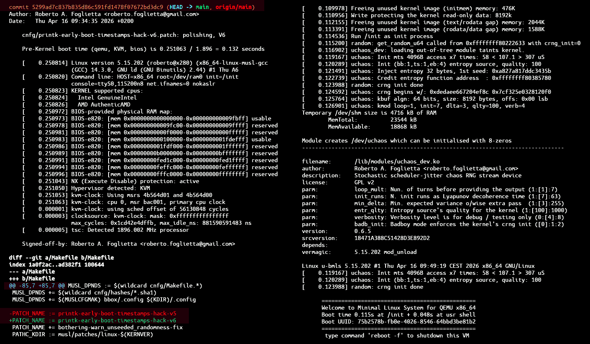

## μChaoSys

**`(c)`** 2026 – Roberto A. Foglietta &lt;roberto.foglietta@gmail.com&gt;, CC BY-NC-ND 4.0

- &nbsp;Click on the button to know how to &nbsp;[](https://github.com/sponsors/robang74)&nbsp; this project and get in touch with me.

uChaoSys is a minimal Linux system (2MB) running by a size-reduced musl-glib static-linked qemu (7.5MB) and cpu/ram jittering randomness init of Linux cnrg for a faster and safer boot (0.1s). The full binary snapshot is a self-sufficient and self-running system. United with sources and documentation is an embedded Linux course including kernel internals/module basics that can be delivered in a 6MB gzipped archive including static-linked PractRand.

<br>


> [!WARNING]
>
> **μChaoSys** isn't an operative system but a recipe to create a specific operative system. A recipe that a bright kid can operate as well as the recipe's product, but a dumb adult cannot. Deliberately and hopefully, this warning helps everyone to grasp how silly/mad is, in its fundamentals, the idea to divide knowledge and agency by age.

<br>

### μChaos minimal Linux qemu bootable system

This project is based on the previous case study `random.txt` in [WIP](https://github.com/robang74/working-in-progress?tab=readme-ov-file#working-in-progress), starting on **2026-01-26**. Which leveraged the [BMLS](https://github.com/robang74/bare-minimal-linux-system) testing system for evolving from shell script (PoC) to the kernel (MVP). The main goal of respawning from scratch the project on a new repository is to strip the project from all that stuff accumulated over and over during the experimental development.

* [Technical Presentation for Commercial Sponsorship](docs/uchaos-sponsorship-presentation.md) &nbsp;(2026-03-16)
* [Why it works so well as training consultancy content](docs/gemini-thinking-uchaosys-peer-review.md#why-it-works-so-well-as-training-consultancy-content) &nbsp;(2026-04-07)

Last but not least, this project provides a micro Linux embedded system with a **footprint below 2MB** (including the kernel and the initramfs, cfr. [Components](README.md#components)) as the result of a building process starting from the sources.

Checking the information below and those reported in the link above, we can agree that this project is interesting from several point of views. Including the ability of self-hosting and self-executing in a cascade KVM 64MB to TCG 32MB, for example.

<br>

### Configuration

In this peculiar system configuration uChaos replaces all the entropy sources within the Linux kernel and creates a character device driver that can be seen as a side channel and/or a malicious entropy injection channel, as well.

Moreover, using extreme qemu parameters settings, it is possible testing the system into a condition of complete isolation (AFAIK) which grants the predictability by repeatability across reboots of the uchaos and Linux crng randomness providers, both.

<br>

### information

The data reported below are indicative and specific for the reference tagged version [v0.6.5](https://github.com/robang74/uchaosys/releases/tag/v0.6.5) which adopts the all-static policy (footprints: +3% sys, +1% musl) and boots on an experimental *frankenstein* glibc-musl all-static qemu compiled on Ubuntu 22.04 (footprint: +25% dev/build).

Reference processor **i5-8365**, toolchain metrics:

- `system building total time:  970 s  (16m 10s)`&hairsp;¹
- `dev/build environment size: 5562 MB (5.43 GB)`
- `repository .zip copy  size:  613 KB (pdf+img)`

Reference architecture **x86_64**, system footprint:

- `uncompressed .cpio    size:  672 KB`
- `initramfs.cpio.gz     size:  436 KB`
- `linux kernel image    size: 1468 KB`
- `qemu bootable system  size: 1904 KB (1.86 MB)`&hairsp;²

Running this minimal system, the essential metrics:

- `CPU single-pipeline KVM: sh start.sh -q -m 32`
- `total time for being ready to user: 0.064 s `**!!!**
- `total available memory in userland: 18860 KB`
    - `host: 32768, zram: -4715, cpio:  -672 KB`
    - `mlnx: 23528, used: -2384, buff: -1500 KB`

It is interesting to note how the memory is allocated&hairsp;.<br>

¹ in v0.6.8 without sources download variable time.<br>
² without `RNG_test` for which .cpio size +2.28 MB.

<br>

### Components

- **musl v1.2.15**, and related packages for the cross-compilation toolchain;
- **busybox v1.38**, as the whole initramfs system component and user shell;
- **linux v5.15.202**, as the kernel from a very widely spread LTS branch;
- **uchaosbox & dev.ko**, as userland utility toolbox and char device driver;
- **qemu v10.2.2**, as machine emulator with virtio/microvm/q35 support.

#### External tools

- [dL1](https://github.com/robang74/bare-minimal-linux-system/raw/refs/heads/main/update/common/usr/bin/RNG_test.gz.sh) &dash; **PractRand RNG_test**, external static tool for testing randonmess quality
- [dL2](https://github.com/robang74/bare-minimal-linux-system/raw/refs/heads/main/update/common/usr/bin/cmd.gz.sh) &dash; **gzcmd.sh**, converts an executable in a gziped self-extracting executable

While PractRand `RNG_test` (2288&nbsp;KB) is indispensable for testing, the `gzcmd.sh` is also relevant despite initramfs compression. In fact, the unreclaimable memory is allocated to host the uncompressed initramfs (aka `cpio` archive).

The `RNG_test.gz.sh` (906&nbsp;KB) is 1366&nbsp;KB lighter than the original, as much as the `bzImage`. Indeed, `RNG_test` requires a lot of RAM when working versus which the gzcmd saving isn't relevant but the rationale remains, presented here as a practical example.

However, using gzcmd executables make sense only when a storage is available. Otherwise there are two copies in RAM, at least. After all, `gzcmd.sh` exists as an alternative to compressed archives and initramfs is nothing else than a compressed `cpio` archive.

<br>

### Abstract

In this specific system configuration kernel is compiled in such a way that uChaos is the only source of entropy available (and just for seed the internal crng once) by loading the module which needs to [hack the kernel internals](docs/linux-kernel-internals-hacking.md) because backport fix from 6.x left a corner case uncovered.

It is worth to underline that this choice is not suggested as per a standard case use of uChaos but it is necessary for testing uChaos/crng duo excluding every possible internal source of interference: if it doesn't fail, it isn't because other sources of entropy are supplying.

- [A Paradigm Shift: from Entropy Collection to Chaos Conduction](docs/uchaos-the-entropy-paradigm-shift.md) &nbsp;(2026-03-19)
- [A Paradigm Shift: are ramdomness and certifications secure?](docs/linux-kernel-internals-hacking.md#randomness-and-security) &nbsp;(2026-05-06)

It is essential to underline that uChaos at the time of this text first writing (v0.6) was a 7½-weeks long project developed by a single person (started on 2026-01-26) while the randomness in kernel space is a decades long team collaboration project. Hence, the same results in the same conditions, whatever confirmed, isn't something trivial to achieve.

Last but not least, the chaos engine is **exactly** the same in kernel and user spaces: the same [`uchaos_dev.h`](kdev/uchaos_dev.h) translated in userspace by trivial macros. It compiles twice, and the two binaries never misalign: same file, same code. Audited once, it runs everywhere.

<br>

### Quick Start

> [!WARNING]
>
> Due to the recent and unusual network failures of the open source mirrors placed across the ocean, `make sources` might need to be executed a few times before complete correctly and in full. Tarball repositories aren't related with this project or github, but run by 3rd parties. Edit `cnfg/Makefile.musl` or `musl/Makefile` and choose your geographically nearest mirrors for the best download performances.

```sh
url="github.com/robang74/uchaosys.git"
git clone https://$url --jobs $(nproc)
cd uchaosys
#    git switch ${branch:-main}
#    make copysrc FROM=$prevpath
time make sources
#    real	 2m42.075s
time make buildall status
#    real	22m35.016s  <-- everything since v0.6.9

# to run uChaoSys on u/qemu
make runqemu
# to test self-hosting u/qemu
make qemutest

# function for generation rate test
px() { echo "px n:$1" >&2; eval parallel -uj$1 "'$2'" ::: {1..$1}; }
# to test speed and DRAM tail slayer jittering
px 8 "kdev/uckaos 16384"  | dd bs=1M of=/dev/null
#> Init mts 4096B access x7 times: 56 < 615.3 > 2966 nS
#> Init mts 4096B access x7 times: 51 < 558.6 > 2728 nS
#> Init mts 4096B access x7 times: 55 < 631.6 > 3083 nS
#> Init mts 4096B access x7 times: 83 < 878.6 > 4183 nS
#> Init mts 4096B access x7 times: 92 < 953.1 > 4513 nS
#> Init mts 4096B access x7 times: 102 < 1016.4 > 4614 nS
#> Init mts 4096B access x7 times: 93 < 930.1 > 4382 nS
#> Init mts 4096B access x7 times: 81 < 882.9 > 4241 nS
#> 1073741824 bytes (1.1 GB, 1.0 GiB) copied, 13.4836 s, 79.6 MB/s
px 4 "kdev/uckaos 32768"  | dd bs=1M of=/dev/null
#> 1073741824 bytes (1.1 GB, 1.0 GiB) copied, 11.6083 s, 92.5 MB/s
px 1 "kdev/uckaos 131072" | dd bs=1M of=/dev/null
#> 1073741824 bytes (1.1 GB, 1.0 GiB) copied, 43.1761 s, 24.9 MB/s

# QA w/ RNG_test using PractRand version 0.96
p8 | prnd/RNG_test stdin64
#> ...
#> rng=RNG_stdin64, seed=unknown
#> length= 1 gigabyte (2^30 bytes), time= 14.6 seconds
#>  no anomalies in 227 test result(s)
```

The instructions above are able to provide the same output in about 20m, depending on the download transfer rate, unfortunately these days many GNU repositories are experiencing severe downtime.

- [uchaosys snapshot](https://github.com/robang74/working-in-progress/tree/main/uchaosys.qemu) &nbsp; bzImage **v0.6.3** + uqemu **v0.6.6** + initramfs &hairsp;w/ uchaos **v0.7.0**

Considering that the system footprint is below 2MB, offering a binary sample makes sense independently from the outages. This snapshot is not supposed to be updated often, therefore refers to the above project link.

<br>

### Hacked μ-qemu

- [μ-footprint hacked qemu edition](qemu/) &hairsp;host page, last version

Since v0.6.5 this project also provides the option of compiling an experimental *frankenstein* [glibc-musl static](qemu/glibc-musl-fix.c) edition of the `qemu-system-x86_64` binary ([v0.6.7](https://github.com/robang74/uchaosys/releases/tag/v0.6.7): 7264&nbsp;KB, -3% minz w/lto) which uses a subset of ROMs (360&nbsp;KB, tgz: 219&nbsp;KB).

> FILE: 'qemu-system-x86_64.gz.sh', HEAD: 982 (1024),
> GZIP: 2651098 (2589 Kb, 35 %), GZSH: v0.1.8

> FILE: 'RNG_test.gz.sh', HEAD: 972 (1024),
> GZIP: 921418 (900 Kb, 39 %), GZSH: v0.1.8

It is worth to note that the whole package uChaoSys + u-QEMU + RNG_test once compressed – by [`gzcmd.sh`](https://github.com/robang74/bare-minimal-linux-system/blob/main/gzcmd.sh) in a self-executable or by `gzip` into the `initramfs.cpio.gz` – remains **under 6MB** (precisely 5.99&nbsp;MB).

The result above has been achieved in 7-days from the initial commit of this project. Here below after 1mo:



Pre-Kernel boot time related to qemu, KVM and bios/roms is:
- `0.251 / 1.896 = 0.13 s` **→** total: `0.298 s` (verbose printouts on the console)
- `0.219 / 1.896 = 0.12 s` **→** total: `0.208 s` (**quiet**, boot data collection by dmesg)

Printouts on the console are responsible for not less than 1/3 of the boot time **!!!**

```sh
virt/qemu-system-x86_64 -m 32 -kernel bzImage -initrd initramfs.cpio.gz \
-nographic -vga none -display none -no-reboot -name tinylnx -enable-kvm \
-cpu host,migratable=off,+invtsc -overcommit mem-lock=on -append 'quiet '\
'HOST=x86_64 root=/dev/ram0 init=/init console=ttyS0,115200n8 net.ifnames=0 '\
'nokaslr' -M q35,accel=kvm,usb=off,vmport=off,dump-guest-core=off -boot order=dc
```

<br>

### License

The overall license for the uChaoSys binaries is dependent on the system components thus the GPLv2 is the reference as the most demanding license among those involved as long as "GPLv2 or later" means GPLv2 as an option.

