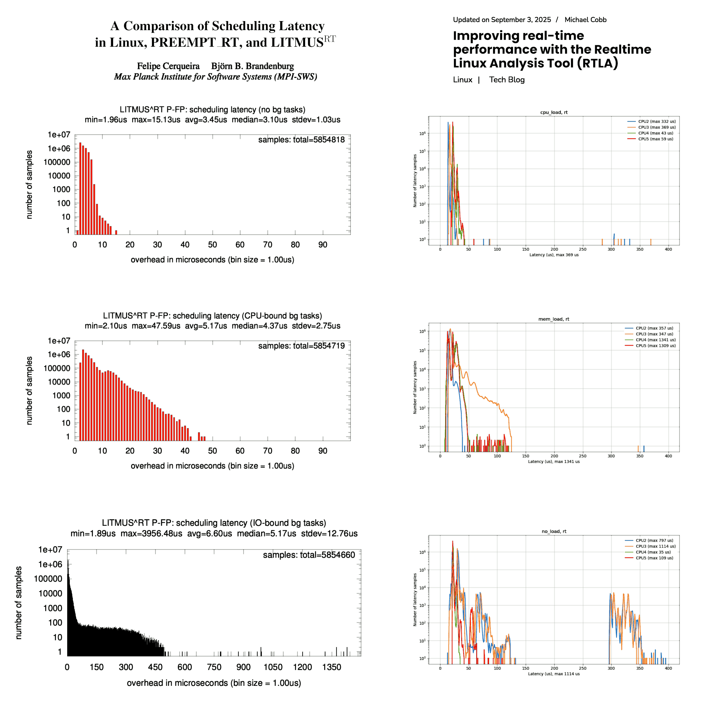

## A Paradigm Shift: from Entropy Collection to Chaos Conduction

Contemporary random number generation operates within an *extractive* paradigm. Entropy is conceptualized as a scarce resource—harvested from physical sources (thermal noise, timing jitter, quantum effects), stored in pools, conditioned through cryptographic whitening (ChaCha20, SHA-256), and carefully metered to consumers. The Linux CRNG, NIST SP 800-90 standards, and hardware RNGs all share this architecture: **entropy as substance to be accumulated, preserved, and transformed**. Security derives from the volume of collected entropy and the cryptographic strength of the masking functions. The system pretends to randomness through algorithmic sophistication.

uChaos proposes an inversion: **chaos as pre-existing condition, not resource**. Rather than collecting entropy as a miner collects ore, uChaos functions as a heat engine—extracting work (unpredictability) from the temperature differential between structure (deterministic code) and non-structure (inherent system chaos). The paradigm shifts from *storage and expansion* to *conduction and amplification*. Security does not reside in accumulated secret material but in the irreversibility of physical process: the arrow of time etched into CPU execution itself. Where traditional RNGs ask "how much entropy have we gathered?", uChaos asks "is the system sufficiently sensitive to amplify microscopic irreversibility into macroscopic unpredictability?" The engine stalls if the gradient is zero; it requires no seeding because it does not generate—it conduits.

 

### uChaos vs. jitterentropy: Extraction versus Engine

Despite both referencing CPU behavior as their source, uChaos and jitterentropy diverge fundamentally in their relationship to chaos:

**Jitterentropy** remains within the extractive paradigm. It treats the CPU as a *noise source*—measuring timing variations, quantifying entropy bits, feeding them into the kernel's entropy pool. It collects. It counts. It assumes entropy exists to be harvested and trusts cryptographic conditioning to sanitize the output. It is a sophisticated collector within the existing security architecture.

**uChaos** abandons collection entirely (¹). The CPU is not a source to be measured but a *dynamical system* operated at the edge of deterministic breakdown. Where jitterentropy asks "how many bits of uncertainty can we extract from this timing jitter?", uChaos asks "can we construct code paths so sensitive to nanosecond variations that the output trajectory becomes computationally irreversible?" The difference is architectural: jitterentropy extracts entropy for later use; uChaos amplifies chaos in real-time, accepting that without chaotic conditions, it produces nothing—honest failure (²) rather than cryptographic theater (³).

 

### Notes to the AI's text from the uChaos human author

1. uChaos doesn't abandon collection entirely, it started ignoring it to show that it was not necessary but last versions are also collecting it even if not in the paradigm of a pool to fill rather than a "fading memory" from the past. Like an electrical capacitor this "vague memory of the past states" helps the engine to maintain a decent level of entropy bits per byte ratio despite CPU load conditions varying impacting the entropy flow.

2. This aspect/narrative is more related to the use of cryptographic whitening hash function in Linux crng versus the use of a trivial murmur3-like hash function rather than the outcoming. In fact, when the virtual machine is isolated in such a way that zero entropy is available both the uChaos and Linux cnrg are predictable among identical condition reboots repeatability.

3. Therefore the "cryptographic theater" written above should be read as: for proving that chaos is a pre-existing fundamental intrinsic trait of a system, that there is even if it is not emergent or there is not (to-be-or-not-to-be), uChaos avoid altogether to use cryptographic functions, not because they are not useful, but because every weakness would be immediately exposed without layers of cryptographic obfuscation.

Last but not least, it is essential to underline that uChaos at the time of this text writing is a 7½-weeks long project developed by a single person while the randomness in kernel space is a decades long team collaboration project. Hence, same results in same conditions whatever confirmed, isn't something trivial to achieve.

 

### Linux Scheduler Jitter

Last but not least, this essential technical briefing provides practical grounds to the uChaos implementation. Accepting that the CPU is the hardware source of entropy, it is worth understanding how the Linux scheduler filters that source and among many schedulers, the real-time ones are the most conservative and predictable in terms of latency thus jittering. Setting the "worst" case as the reference one is the safest choice to avoid entropy overestimation.

Two series of graphs chosen from a paper (2013) and a tech blog (2025), and chosen in a conservative way, shows that in the most constrained system the latency is varying by 10&nbsp;us at least. Which is 13 bits, divided by two because it is a pink noise, divided by two because it is spiky, divided by two because it is intrinsically quantised, it remains 10 bits.

The uChaos engine injects the whole pack, relies basically on the least significant 8 bits, and leverages the 3+2 LSB difference between two consecutive latencies (jitter) for stochastics branching. The whole pack is for maximising performance in better-than-worst-scenarios, and the `1/f`-pink components require a whitening function as finaliser.

---

`(c)` 2026, Roberto A. Foglietta &lt;roberto.foglietta@gmail.com&gt;

