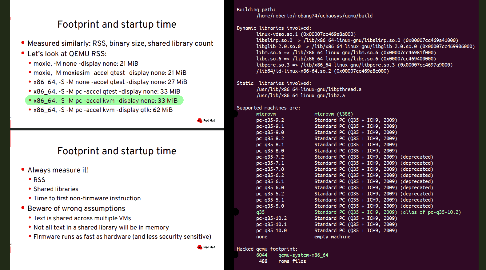

## μ-footprint hacked qemu edition

**`(c)`** 2026 – Roberto A. Foglietta &lt;roberto.foglietta@gmail.com&gt;, CC BY-NC-ND 4.0

- &nbsp;Click on the button to know how to &nbsp;[](https://github.com/sponsors/robang74)&nbsp; this project and get in touch with me.

<br>

In 2019, RedHat presented the minimal footprint QEMU at 31MB for the Q35 machine with KVM support. I tested a similar configuration and I found out that it was not less than 28MB. In these six years they did a good job in reducing 10% of the minimal footprint.

- [KVM Forum 2019 (un)bloated QEMU](https://static.sched.com/hosted_files/kvmforum2019/c6/kvmforum19-bloat.pdf) &nbsp;(PDF slides, by RedHat)

I did a "trick of mine", possibly two, and the minimal footprint to have a x86-64 with both kvm (q35) and tcg (microvm) is **a bit less than 8MB** (bios & roms included). As shown in the screenshot below which refers to the v0.6.5. Moreover, using [uzpexec](https://github.com/robang74/gzcmd.sh#uzpexec) the self-inflate executable's `UZP` format size shrunk to 2.55MB (available [here](https://github.com/robang74/working-in-progress/tree/main/uchaosys.qemu)).



---

### Quick Start

The following instructions set builds a **qemu v10.2.2** binary:

```sh
# uChaoSys pre-requisite:
#   make sources buildall
cd virt
sh start.sh -qm32
```

Since [v0.6.5](https://github.com/robang74/uchaosys/releases/tag/v0.6.5) the outcoming elf64 binary is an experimental *frankenstein* [glibc-musl static](glibc-musl-fix.c) footprint reduced edition of the `qemu-system-x86_64` binary (7260&nbsp;KB, v0.7.1) which uses a subset of ROMs (360&nbsp;KB).

The outcoming `uqemu` system emulator supports `microvm` and `q35` machines, the `tgc` (sw) and the `kvm` (hw) acceleration, as long as the kernel module for `kvm` support and userland access privileges are granted, obviously.

> [!NOTE]
>
> The `qemu-system-x86_64`, provided in `UZP` self-inflate executable, appears to be an x86 ELF 32-bit LSB executable. That type file refers to the extractor. While qemu is expanded in RAM and execute in its original ELF 64-bit format.

- [uchaosys snapshot](https://github.com/robang74/working-in-progress/tree/main/uchaosys.qemu) &hairsp;folder for bzImage + initramfs **v0.6.3** &hairsp;w/ uqemu **v0.6.6** glibc-musl static elf64

It has **not** been extensively tested and it was designed for embedded systems in mind, not desktops. However, it passed the self-contained self-hosted test which can be considered the ultimate health check in terms of a self-sufficient static binary: it works also for the embedded systems for which it has been designed for.

### qemu-in-qemu

> [!NOTE]
>
> This glibc-musl static qemu is capable of self-hosting and self-emulation. These aren't strictly necessary features, apart being the definitive binary healthy check. And qemu-in-qemu also works when delivered in `UZP` format without extra burden because `gzip` in compressing the CPIO archive skips already compressed files.

```sh
cp -arf virt cpio.tmp
cd virt
sh start.sh -uqm64
  > cd virt
  > sh start.sh -zw -m32 -M q35
  >   > free; head /proc/cpuinfo
  >   > qq
  > qq
# to restore the default state
rm -rf ../cpio.tmp/virt
sh start.sh -U
```

The second started is an instance running on a u-qemu KVM w/64MB of RAM in which the virtualisation stuff has been copied into the initramfs and then executed after the boot in software emulation w/32MB.

---

### Rationale

The debloating here presented is a quick hack that removes the CXL support without introducing a `--disable-cxl` parameter that `configure` can deal acting upon a value on a specific define like `CONFIG_DISNABLE_CXL` but passed by `-D_DISABLE_CXL` in `--extra-cflags`. Which implies that the proposed hack is for testing only.

#### Impact

- You won't find a CXL device in a typical workstation, laptop, or embedded system.

Compute Express Link (CXL) is an open standard interconnect for high-speed, high capacity CPU-to-device and CPU-to-memory connections, designed for high performance data center computers. The CXL specification 1.0 and 1.1 were released in 2019, based on PCIe 5.0 bus protocol support which allows the host CPU to access shared memory on accelerator devices with a cache coherent protocol.

CXL is designed for high performance data center computers, and the first real-world CPU support arrived with Intel Sapphire Rapids and AMD Zen 4 EPYC "Genoa" and "Bergamo" in 2021 — both server-class parts.

PCIe 5.0 on consumer/desktop platforms only started appearing with Intel 12th/13th gen and AMD Ryzen 7000, but even then those platforms don't expose CXL — the CPU has the PHY but the ecosystem (CXL memory expanders, accelerators) remains entirely a datacenter story.

---

### arm64 userland

For testing the ARM64 [uzpexec](https://github.com/robang74/uzpexec) a arm-x86 userland translator was necessary. Moreover, the need was about having a recent stable version to support `execvat()` system call. Therefore, it has been built starting from this project.

- `make qemu-arm64` -- generates it and uses `uzpack` to compress it
- `1496	qemu/qemu-aarch64-static` -- the result is pretty shrunk in size (Kb)

The target `qemu-arm64` is optional and it is not built by default

